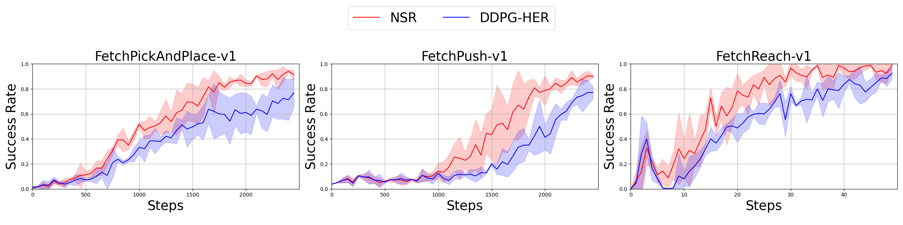

# NSR + DDPG + HER
Implementation of "Novelty-based Sample Reuse for Continuous Robotics Control"   

## Dependencies  
- gym == 0.17.2  
- matplotlib == 3.1.2  
- mpi4py == 3.0.3  
- mujoco-py == 2.0.2.13  
- numpy == 1.19.1  
- opencv_contrib_python == 3.4.0.12  
- psutil == 5.4.2  
- torch == 1.4.0  

## Installation
```shell
pip3 install -r requirements.txt
```

## Usage
```shell
mpirun --oversubscribe -np 8 python3 -u main.py --env_name [envname] --rnd_weights_used [weight_used] --seed [seed]
envname:[FetchPickAndPlace-v1, FetchPush-v1, FetchReach-v1]
weight_used:[train_counts, not_used, rnd_norm, ablation_mean, ablation_mean_distrib]
```
## Results



## Reference
1. [_Continuous control with deep reinforcement learning_, Lillicrap et al., 2015](https://arxiv.org/abs/1509.02971)  
2. [_Hindsight Experience Replay_, Andrychowicz et al., 2017](https://arxiv.org/abs/1707.01495)  
3. [_Multi-Goal Reinforcement Learning: Challenging Robotics Environments and Request for Research_, Plappert et al., 2018](https://arxiv.org/abs/1802.09464)  
## Acknowledgement
This project references and modifies the following open-source code:
- **Original Author**: [@Alireza Kazemipour](https://github.com/alirezakazemipour)
- **Original Project**: [DDPG-HER](https://github.com/alirezakazemipour/DDPG-HER)

- **Original Author**: [@TianhongDai](https://github.com/TianhongDai)
- **Original Project**:[his simplified implementation:hindsight-experience-replay](https://github.com/TianhongDai/hindsight-experience-replay) of [the original OpenAI's code](https://github.com/openai/baselines/tree/master/baselines/her)

Special thanks to the original author for their excellent work! The following modifications were made to the original code:
We added the code for the proposed NSR method, which improves the convergence rate and success rate of algorithms without significantly increasing time consumption.

